# 🔐 Proyecto Criptografía

### Integrantes del equipo y roles

| Integrante | Rol |
|-----------|-----|
| [Hernández Ramírez Miguel Angel](https://github.com/Miguel07FI) | Desarrollo, Revisor de código, Avances |
| [Hernández Gutiérrez Carlos Mario](https://github.com/C4rlos316) | Desarrollo, Testing, Project Manager |
| [Solís Espinosa Andrea Vianney](https://github.com/aviansol) | Desarrollo, Arquitectura, Diseño del sistema |
| [Rivera Lopez David Zaid](https://github.com/AvalonRD) | Desarrollo, Documentación, Analista de riesgos |
| [Suárez Román Clara Alin](https://github.com/clarasrzfi) | Desarrollo, Documentación técnica, Validación de seguridad |

## Arquitectura y modelo de amenazas

---

## 1. Visión General del Sistema

### ¿Qué problema resuelve este vault?

El **Secure Digital Document Vault** aborda la vulnerabilidad inherente en el intercambio de archivos digitales sobre canales inseguros y el almacenamiento en reposo no confiable. Nuestra propuesta resuelve el problema de la gestión de secretos, eliminando la dependencia de la confianza en el proveedor de almacenamiento y mitigando errores humanos comunes en la gestión manual de claves:

- Solo los destinatarios autorizados puedan acceder al contenido
- El contenido no pueda ser modificado sin detección
- El origen del documento pueda ser verificado de manera confiable
- Las claves privadas de los usuarios estén protegidas incluso si el dispositivo es comprometido

### Características principales

####  Cifrado de archivos
Proceso mediante el cual los documentos se transforman en datos ilegibles para terceros no autorizados, utilizando algoritmos criptográficos avanzados que aseguran confidencialidad y resistencia frente a intentos de descifrado no autorizados.

####  Compartición segura
Mecanismo que permite distribuir archivos cifrados únicamente a destinatarios previamente seleccionados, garantizando que solo ellos puedan acceder al contenido mediante claves o credenciales específicas, evitando filtraciones o accesos indebidos.

####  Firma digital
Técnica criptográfica que vincula de manera única al autor con el documento, proporcionando evidencia verificable de autenticidad y asegurando que el contenido no ha sido alterado desde su firma, además de ofrecer protección contra el repudio.

####  Gestión de claves
Conjunto de procedimientos que abarcan la creación, almacenamiento seguro, distribución controlada y eventual renovación de claves criptográficas, asegurando que estas permanezcan protegidas y disponibles únicamente para usuarios autorizados.

####  Verificación de integridad
Método de comprobación que valida que los documentos no han sufrido modificaciones, mediante el uso de funciones hash o sumas de verificación, garantizando que el contenido recibido es idéntico al original.

####  Control de acceso y auditoría
Sistema que define permisos específicos para cada usuario o grupo, regulando acciones como lectura, edición o eliminación, acompañado de registros detallados de todas las operaciones realizadas para asegurar trazabilidad y cumplimiento normativo.

---

### Fuera del Alcance

Los siguientes elementos **NO** forman parte del sistema:

| Elemento | Razón |
|----------|-------|
| **Almacenamiento en la nube o servidor centralizado** | Requiere infraestructura adicional y gestión de disponibilidad, lo cual excede el objetivo de protección documental. |
| **Sistema de mensajería en tiempo real** | Implica comunicación instantánea y sincronización continua, lo cual no corresponde al enfoque de seguridad de archivos. |
| **Revocación de acceso a documentos ya compartidos** | Demanda un control dinámico posterior a la distribución, lo que requiere arquitecturas más complejas de gestión de derechos digitales. |
| **Versionamiento de documentos** | Implica mantener múltiples estados históricos de un archivo, lo cual pertenece a sistemas de gestión documental más amplios. |
| **Sincronización automática entre dispositivos** | Requiere integración con múltiples plataformas y servicios, lo que añade complejidad operativa fuera del objetivo principal. |
| **Disponibilidad y resistencia a ataques DoS** | Corresponde a medidas de infraestructura y seguridad de red, más relacionadas con servidores que con documentos cifrados. |
| **Anonimato de red** | Involucra técnicas de ocultamiento de identidad en la comunicación, lo cual pertenece al ámbito de privacidad en redes y no al manejo de archivos. |
| **Ocultar la existencia del archivo** | Implica técnicas de esteganografía o disimulación, que van más allá de la protección mediante cifrado y gestión de claves. |
| **Recuperación de contraseñas olvidadas** | Requiere mecanismos adicionales de gestión de credenciales y políticas de soporte al usuario, lo cual no es parte del alcance definido. |
| **Gestión de archivos digitales una vez cifrado** | Corresponde a sistemas de administración documental posteriores al cifrado, como organización, clasificación o eliminación. |

---

## 2. Diagrama de Arquitectura

### Descripción del Flujo Operativo

El diagrama de arquitectura ilustra el flujo operativo de la Bóveda Segura de Documentos Digitales, estableciendo una separación estricta entre los **componentes de confianza**, alojados en el lado del cliente, y los **componentes no confiables**, correspondientes a la red y al almacenamiento remoto.

####  Proceso de Emisión (Cifrado)

El proceso de emisión inicia cuando el usuario proporciona:
- Su **contraseña**
- El **archivo en texto claro**
- La **selección del destinatario**

**Flujo detallado:**

1. **Desbloqueo del Key Store**
   - La contraseña es procesada mediante una función de derivación de claves (**KDF**)
   - Se desbloquea el Key Store local
   - Se extrae de manera segura la clave privada del remitente en memoria temporal

2. **Cifrado del Archivo**
   - El sistema genera una clave simétrica aleatoria y única para el documento
   - Se emplea un esquema de cifrado autenticado (**AEAD**) para transformar el archivo original
   - Se garantiza tanto confidencialidad como integridad

3. **Envolvimiento de Clave**
   - La clave simétrica es "envuelta" mediante cifrado asimétrico
   - Se utiliza la clave pública del receptor
   - Solo el destinatario autorizado podrá acceder a la información

4. **Firma Digital**
   - El sistema calcula una firma digital utilizando la clave privada del remitente
   - Se dota al paquete de evidencia criptográfica para el no repudio
   - Se valida la autenticidad del emisor

5. **Ensamblaje del Contenedor**
   - Todos los elementos se consolidan en un contenedor único:
     - Archivo cifrado
     - Claves envueltas
     - Metadatos
     - Firma digital
   - Se estructura dentro del entorno seguro del cliente

####  Transmisión Segura

Una vez ensamblado, el contenedor es transmitido a través de un canal de red seguro (mediante **TLS/SSL**) hacia el servidor backend. El entorno remoto (API y base de datos central) asume un **modelo de almacenamiento no confiable**. El servidor actúa exclusivamente como un repositorio inerte de los contenedores cifrados y del almacén de claves públicas, careciendo por completo de la capacidad para leer el contenido de los archivos o extraer las claves simétricas.

####  Proceso de Recuperación (Descifrado)

El modelo detalla el flujo de recuperación y verificación ejecutado por el destinatario:

1. **Descarga del Contenedor**
   - El destinatario descarga el contenedor desde el almacenamiento remoto

2. **Verificación de Firma**
   - La aplicación ejecuta una validación de la firma digital **ANTES** de cualquier manipulación
   - ❌ Si la firma es inválida → proceso se detiene inmediatamente
   - ✅ Si la firma es válida → continúa el proceso

3. **Desenvolvimiento de Clave**
   - El sistema desenvuelve la clave simétrica
   - Utiliza la clave privada del receptor (desbloqueada previamente con su contraseña)

4. **Descifrado del Archivo**
   - Se emplea la clave simétrica recuperada para revertir el proceso AEAD
   - Se descifra el archivo original
   - Se entrega al usuario de forma íntegra dentro de su dispositivo local

---

###  Diagrama Visual

```mermaid
graph LR
    %% ========================
    %% ESTILOS
    %% ========================
    classDef usuario fill:#E8F5E9,stroke:#4CAF50,stroke-width:3px,color:#1B5E20
    classDef confiable fill:#E3F2FD,stroke:#2196F3,stroke-width:3px,color:#0D47A1
    classDef noConfiable fill:#FFEBEE,stroke:#F44336,stroke-width:3px,color:#B71C1C
    classDef proceso fill:#FFF9C4,stroke:#FBC02D,stroke-width:2px,color:#F57F17
    classDef decision fill:#F3E5F5,stroke:#9C27B0,stroke-width:2px,color:#4A148C
    classDef transporte fill:#FCE4EC,stroke:#E91E63,stroke-width:3px,color:#880E4F
    classDef almacenamiento fill:#FFCCBC,stroke:#FF5722,stroke-width:2px,color:#BF360C
    classDef seguridad fill:#C8E6C9,stroke:#66BB6A,stroke-width:2px,color:#2E7D32
    classDef salida fill:#DCEDC8,stroke:#9CCC65,stroke-width:2px,color:#558B2F
    classDef titulo fill:#FFEBEE,stroke:#F44336,stroke-width:4px,color:#B71C1C,font-weight:bold
    
    %% ========================
    %% USUARIO
    %% ========================
    Usuario((Usuario)):::usuario
    Archivo[Archivo]:::usuario
    Password[Contraseña]:::usuario
    Destinatarios[Destinatarios<br/>Claves Públicas]:::usuario
    
    Usuario --> Archivo
    Usuario --> Password
    Usuario --> Destinatarios
    
    %% ========================
    %% CLIENTE CONFIABLE
    %% ========================
    subgraph Cliente["LADO DEL CLIENTE - ZONA CONFIABLE"]
        direction LR
        
        subgraph Preparacion["Preparación del Archivo"]
            direction TB
            GenClave[Generar Clave<br/>Simétrica]:::proceso
            GenNonce[Generar<br/>Nonce]:::proceso
            AEAD[Cifrado AEAD<br/>AES-GCM/ChaCha20]:::proceso
            Metadatos[Metadatos<br/>AAD]:::proceso
        end
        
        subgraph Seguridad["Gestión de Claves"]
            direction TB
            KDF[KDF<br/>Argon2/PBKDF2]:::seguridad
            KeyStore[KeyStore<br/>Privada Cifrada]:::seguridad
            PrivKey[Clave<br/>Privada]:::seguridad
            Firma[Firma<br/>Digital]:::seguridad
        end
        
        subgraph Envoltura["Envolvimiento"]
            direction TB
            Wrap[Envolver Clave<br/>RSA-OAEP/ECIES]:::proceso
        end
        
        Contenedor[CONTENEDOR<br/>━━━━━━━━━━<br/>Ciphertext<br/>Nonce + Tag<br/>Claves Envueltas<br/>Metadatos<br/>Firma Digital]:::confiable
    end
    
    %% Flujo de cifrado
    Archivo --> GenClave
    GenClave --> GenNonce
    GenClave --> AEAD
    GenNonce --> AEAD
    Metadatos --> AEAD
    Destinatarios --> Wrap
    GenClave --> Wrap
    Password --> KDF
    KDF --> KeyStore
    KeyStore --> PrivKey
    PrivKey --> Firma
    AEAD --> Contenedor
    Wrap --> Contenedor
    
    %% Flujo de firma (bidireccional)
    Contenedor -->|Datos a Firmar| Firma
    Firma --> Contenedor
    
    %% ========================
    %% RED NO CONFIABLE
    %% ========================
    subgraph RedTransporte["RED NO CONFIABLE"]
        TLS{TLS/SSL<br/>Canal Seguro}:::transporte
    end
    
    Contenedor --> TLS
    
    %% ========================
    %% SERVIDOR NO CONFIABLE
    %% ========================
    subgraph Servidor[" "]
        direction TB
        TituloServidor["SERVIDOR DE ALMACENAMIENTO REMOTO<br/>ZONA NO CONFIABLE"]:::titulo
        Backend[Servidor Backend<br/>Repositorio Pasivo]:::noConfiable
        Storage[(Base de Datos)]:::almacenamiento
        ArchivosCifrados[Archivos Cifrados]:::almacenamiento
        
        TituloServidor --> Backend
        Backend --> Storage
        Storage --> ArchivosCifrados
    end
    
    TLS --> Backend
    ArchivosCifrados -->|Recuperar| TLS
    
    %% ========================
    %% RECUPERACION
    %% ========================
    subgraph Recuperacion["PROCESO DE RECUPERACIÓN Y DESCIFRADO"]
        direction LR
        Descargar[Descargar<br/>Contenedor]:::proceso
        Verificar[Verificar Firma<br/>PRIMERO]:::seguridad
        Decision{Firma<br/>válida?}:::decision
        Abortar[ABORTAR<br/>Proceso]:::noConfiable
        Unwrap[Desenvolver<br/>Clave]:::proceso
        Descifrar[Descifrar<br/>Archivo AEAD]:::proceso
        Original[Archivo<br/>Original]:::salida
    end
    
    TLS --> Descargar
    Descargar --> Verificar
    Verificar --> Decision
    Decision -->|NO| Abortar
    Decision -->|SÍ| Unwrap
    Unwrap --> Descifrar
    Descifrar --> Original
```

---

## 3. Requisitos de Seguridad

Para los requisitos de seguridad se tienen las siguientes propiedades:

### RS-1: Confidencialidad del contenido del archivo
**Descripción:** Un atacante que obtenga el contenedor cifrado no debe poder conocer el contenido del archivo sin poseer la clave privada correspondiente del destinatario autorizado.

### RS-2: Integridad del contenido del archivo
**Descripción:** Cualquier modificación al contenido cifrado del archivo debe ser detectada durante el proceso de descifrado, resultando en el rechazo del archivo.

### RS-3: Autenticidad del remitente
**Descripción:** Un destinatario debe poder verificar de manera criptográfica que el archivo fue creado y firmado por el remitente declarado y no por un impostor.

### RS-4: Confidencialidad de las claves privadas
**Descripción:** Las claves privadas almacenadas en el sistema deben estar protegidas mediante derivación de clave basada en contraseña (KDF). Un atacante con acceso al Key Store no debe poder extraer las claves privadas sin conocer la contraseña del usuario.

### RS-5: Protección contra manipulación
**Descripción:** Cualquier alteración de los metadatos del contenedor cifrado (incluyendo las claves envueltas, la firma digital o los identificadores de destinatarios) debe ser detectable e invalidar el archivo completo.

### RS-6: No repudio
**Descripción:** El remitente no debe poder negar haber creado y firmado un documento, ya que la firma digital proporciona evidencia criptográfica de autoría.

### RS-7: Separación de claves por archivo
**Descripción:** Cada archivo debe ser cifrado con una clave simétrica única e independiente. El compromiso de una clave de archivo no debe comprometer otros archivos.

### RS-8: Confidencialidad de claves simétricas de archivo
**Descripción:** Las claves simétricas utilizadas para cifrar archivos individuales no deben ser almacenadas en texto plano. Deben estar protegidas mediante envolvimiento con las claves públicas de los destinatarios.

### RS-9: Verificación antes del descifrado
**Descripción:** La firma digital debe ser verificada **ANTES** de intentar descifrar cualquier contenido. Si la verificación falla, el proceso debe detenerse inmediatamente sin revelar información sobre el contenido.

---

## 4. Modelo de Amenazas

### 4.1 Activos a Proteger

| Activo | Criticidad | Descripción |
|--------|-----------|-------------|
| **Contenido de archivos** |  Alta | El contenido original de los documentos que se comparten |
| **Claves privadas de usuarios** |  **Crítica** | Las claves que permiten descifrar archivos y firmar documentos |
| **Claves simétricas de archivos** |  Alta | Claves únicas generadas para cifrar cada archivo |
| **Contraseñas de usuarios** |  **Crítica** | Credenciales utilizadas para claves de protección del Key Store |
| **Validez de firmas digitales** |  Alta | La confianza en que un documento proviene del remitente declarado |
| **Metadatos de archivos** |  Media | Información como nombre de archivo, tamaño, fecha, destinatarios |
| **Integridad del contenedor** |  Alta | La estructura completa que contiene archivo cifrado + claves + firma |

---

### 4.2 Adversarios

Se detalla una lista de los adversarios que tenemos que considerar:

####  Adversario A1: Atacante Externo con Acceso a Almacenamiento

**Objetivo:** Descifrar el contenido de los archivos o extraer información sensible de los metadatos.

**Capacidades:**
- ✅ Puede leer todos los contenedores cifrados almacenados
- ✅ Puede copiar archivos del sistema de almacenamiento
- ❌ NO tiene acceso a las claves privadas de los usuarios
- ❌ NO conoce las contraseñas de los usuarios
- ❌ NO tiene acceso a la memoria de la aplicación en ejecución

---

####  Adversario A2: Destinatario Malicioso

**Objetivo:** Manipular archivos para que parezcan venir de otro remitente, o modificar contenido sin detección.

**Capacidades:**
- ✅ Tiene acceso legítimo a su propia clave privada
- ✅ Puede descifrar archivos que le fueron compartidos
- ✅ Puede intentar modificar archivos o metadatos
- ✅ Puede intentar suplantar al remitente original
- ❌ NO tiene acceso a las claves privadas de otros usuarios

---

####  Adversario A3: Atacante Man-in-the-Middle

**Objetivo:** Causar que el destinatario acepte un archivo modificado como válido.

**Capacidades:**
- ✅ Puede interceptar y modificar contenedores antes de que lleguen al destinatario
- ✅ Puede alterar bytes del archivo cifrado
- ✅ Puede modificar metadatos, claves envueltas o firmas
- ❌ NO puede generar firmas válidas sin la clave privada del remitente

---

####  Adversario A4: Atacante con Acceso Temporal al Dispositivo

**Objetivo:** Extraer claves privadas para uso futuro.

**Capacidades:**
- ✅ Tiene acceso físico breve al dispositivo del usuario (por ejemplo, dispositivo desbloqueado y desatendido)
- ✅ Puede copiar el Key Store cifrado
- ✅ Puede intentar extraer claves de la memoria
- ❌ NO conoce la contraseña del usuario
- ❌ NO tiene acceso prolongado para realizar ataques sofisticados

---

####  Adversario A5: Atacante con Capacidad de Fuerza Bruta

**Objetivo:** Descifrar el Key Store mediante adivinación de contraseña.

**Capacidades:**
- ✅ Tiene recursos computacionales significativos
- ✅ Puede realizar ataques de diccionario contra contraseñas
- ✅ Puede intentar ataques de fuerza bruta offline contra el Key Store
- ❌ NO puede comprometer los algoritmos criptográficos fundamentales (AES, RSA, etc.)

---

## 5. Supuestos de Confianza

>  El sistema asume que las siguientes condiciones son verdaderas. **Si alguno de estos supuestos es violado, las garantías de seguridad pueden no mantenerse.**

### 1️ Protección de Contraseñas por el Usuario

**Supuesto:** Los usuarios eligen contraseñas suficientemente fuertes y las mantienen secretas. No comparten sus contraseñas ni las almacenan de manera insegura.

**Impacto si se viola:** Un atacante con la contraseña puede descifrar el Key Store y obtener todas las claves privadas del usuario.

---

### 2️ Autenticidad de Claves Públicas

**Supuesto:** Las claves públicas de los destinatarios son auténticas y han sido obtenidas mediante un canal confiable. Los usuarios verifican las claves públicas antes de compartir archivos sensibles.

**Impacto si se viola:** Un atacante podría suplantar a un destinatario y descifrar archivos destinados a ese usuario.

---

### 3️ Integridad de la Aplicación Vault

**Supuesto:** El binario de la aplicación Vault no ha sido modificado por un atacante. Los usuarios obtienen la aplicación de fuentes confiables.

**Impacto si se viola:** Un atacante podría modificar la aplicación para filtrar claves, contraseñas o contenido de archivos.

---

### 4️ Almacenamiento No Confiable

**Supuesto:** Todo almacenamiento persistente (sistema de archivos local, almacenamiento externo) es considerado no confiable. Los atacantes pueden tener acceso de lectura a estos almacenamientos.

**Consecuencia de diseño:** Por esto, todos los datos sensibles se cifran antes del almacenamiento.

---

### 5️ Memoria Segura Durante Ejecución

**Supuesto:** Mientras la aplicación está en ejecución, la memoria del proceso está protegida por el sistema operativo contra acceso no autorizado de otros procesos.

**Impacto si se viola:** Un atacante con acceso a la memoria del proceso podría extraer claves o contraseñas en texto plano.

---

### 6️ Disponibilidad de Claves Privadas para Recuperación

**Supuesto:** Los usuarios son responsables de hacer respaldo de su Key Store cifrado. El sistema no proporciona recuperación de claves si se pierde el Key Store o la contraseña.

**Consecuencia:** La pérdida de la contraseña o del Key Store resulta en pérdida permanente de acceso a todos los archivos cifrados.

---

### 7️ Uso Apropiado del Sistema

**Supuesto:** Los usuarios utilizan el sistema según lo diseñado y siguen las mejores prácticas (por ejemplo, no compartir archivos con destinatarios no confiables, verificar firmas antes de confiar en el contenido).

**Impacto si se viola:** Errores del usuario pueden resultar en exposición de información o aceptación de contenido malicioso.

---

## 6. Revisión de Superficie de Ataque

### 6.1 Entrada de Archivos

**¿Qué hace el sistema?**  
La aplicación lee archivos del disco del usuario para cifrarlos.

**¿Qué puede salir mal?**
- **Archivos demasiado grandes:** Un archivo de 50 GB podría consumir toda la memoria RAM y crashear la aplicación.
- **Nombres de archivo maliciosos:** Un archivo llamado `../../etc/passwd` o con caracteres especiales raros podría causar problemas al procesar rutas o al guardar el contenedor cifrado.
- **Archivos corruptos o malformados:** Aunque solo ciframos el contenido sin parsearlo, archivos con estructuras extrañas podrían revelar bugs en nuestro código.

**¿Qué propiedad de seguridad está en riesgo?**  
Principalmente la **disponibilidad del sistema**.

---

### 6.2 Parsing de Metadatos del Contenedor

**¿Qué hace el sistema?**  
Cuando desciframos un archivo, primero leemos el contenedor cifrado que incluye metadatos en cierto formato (destinatarios, claves envueltas, firma, etc.).

**¿Qué puede salir mal?**
- **JSON malformado:** Un contenedor con JSON inválido podría hacer que el parser falle y crashee la aplicación.
- **Metadatos gigantes:** Un atacante podría crear un contenedor con un campo de 1 GB para causar agotamiento de memoria.
- **Campos inesperados:** JSON con estructuras que no esperamos podría causar comportamiento indefinido si no validamos.

**¿Qué propiedad de seguridad está en riesgo?**  
La **integridad y disponibilidad** del sistema. Queremos evitar que contenedores malformados crasheen la aplicación.

---

### 6.3 Importación y Exportación de Claves

**¿Qué hace el sistema?**  
Los usuarios pueden importar claves públicas de otras personas (para compartirles archivos) y exportar su propia clave pública (para que otros les compartan archivos).

**¿Qué puede salir mal?**
- **Claves públicas inválidas:** Un archivo de clave con formato incorrecto o corrupto podría causar errores al intentar usarlo para cifrar.
- **Sustitución de clave pública:** Un atacante podría reemplazar la clave pública de "Alice" con su propia clave pública en el sistema.
- **Exportar clave privada por error:** Un usuario podría confundirse y exportar su clave privada pensando que es la pública, exponiendo su identidad.

**¿Qué propiedad de seguridad está en riesgo?**  
**Confidencialidad** (si se exporta clave privada por error) y **autenticidad** (si se acepta una clave pública falsa).

---

### 6.4 Manejo de Contraseñas

**¿Qué hace el sistema?**  
Los usuarios ingresan su contraseña para desbloquear su Key Store (que contiene su clave privada).

**¿Qué puede salir mal?**
- **Contraseñas débiles:** Un usuario podría elegir `123456` como contraseña, haciendo trivial un ataque de fuerza bruta si alguien copia su Key Store.
- **Contraseña visible en la terminal:** Si la contraseña se muestra al escribirla o se pasa como argumento de línea de comandos, podría quedar registrada en el historial de bash/zsh o en logs del sistema.
- **Contraseña en memoria por mucho tiempo:** Si la contraseña permanece en memoria después de ser usada, un atacante con acceso a la memoria del proceso podría extraerla.

**¿Qué propiedad de seguridad está en riesgo?**  
**Confidencialidad de las claves privadas**. Si la contraseña se compromete, todas las claves privadas del usuario están expuestas.

---

### 6.5 Selección de Destinatarios al Compartir

**¿Qué hace el sistema?**  
El usuario especifica a quién quiere compartirle un archivo cifrado.

**¿Qué puede salir mal?**
- **Destinatario equivocado:** El usuario quiere compartir con "Alice" pero selecciona por error "Alice Smith", exponiendo información confidencial a la persona incorrecta.
- **Clave pública faltante:** El usuario intenta compartir con "Bob" pero no tiene importada su clave pública, causando que la operación falle.
- **Confusión entre usuarios:** Si dos contactos tienen nombres similares o el mismo nombre, el usuario podría no distinguirlos claramente.

**¿Qué propiedad de seguridad está en riesgo?**  
**Confidencialidad**. El archivo podría ser compartido con alguien que no debería tener acceso.

---

### 6.6 Verificación de Firma Digital

**¿Qué hace el sistema?**  
Antes de descifrar un archivo recibido, verificamos la firma digital para confirmar que proviene del remitente declarado y no ha sido modificado.

**¿Qué puede salir mal?**
- **Verificación omitida por error de programación:** Si por un bug el código no verifica la firma, un atacante podría enviar archivos modificados o falsos y el destinatario los aceptaría como válidos.
- **Verificar DESPUÉS de descifrar:** Si verificamos la firma después de descifrar el contenido, un atacante podría ver cómo funciona el sistema al descifrar el contenido incluso con firma inválida.
- **Clave pública incorrecta:** Si usamos la clave pública equivocada para verificar, podríamos rechazar archivos legítimos o aceptar archivos falsos.

**¿Qué propiedad de seguridad está en riesgo?**  
**Autenticidad del remitente**. No podemos confiar en que el archivo proviene de quien dice ser ni en que no ha sido alterado.

---

### 6.7 Interfaz de Línea de Comandos (CLI)

**¿Qué hace el sistema?**  
Los usuarios interactúan con la aplicación mediante comandos de terminal.

**¿Qué puede salir mal?**
- **Inyección de comandos:** Si pasamos argumentos del usuario directamente a una shell sin sanitizar, un nombre de archivo podría ejecutar comandos maliciosos.
- **Path traversal:** Un argumento como `../../../../etc/passwd` podría hacer que la aplicación lea o escriba archivos fuera de las ubicaciones permitidas.
- **Argumentos contradictorios:** Comandos con flags conflictivos como `--encrypt --decrypt` podrían causar comportamiento indefinido si no los validamos.

**¿Qué propiedad de seguridad está en riesgo?**  
**Integridad del sistema** (comandos maliciosos) y **confidencialidad** (contraseñas en historial).

---

## 7. Restricciones de Diseño Derivadas de Requisitos

Esta tabla muestra cómo cada requisito de seguridad se traduce en una decisión técnica específica:

| Requisito de Seguridad | Restricción de Diseño | Justificación |
|------------------------|----------------------|---------------|
| **RS-1:** Confidencialidad del contenido | Usar cifrado autenticado (AEAD) como AES-GCM o ChaCha20-Poly1305 | AEAD proporciona confidencialidad y autenticación en una sola operación, evitando ataques de padding. |
| **RS-2:** Integridad del contenido | Usar AEAD | El tag de autenticación detecta cualquier modificación del contenido cifrado. |
| **RS-3:** Autenticidad del remitente | Implementar firmas digitales (RSA-PSS o EdDSA) | Solo el poseedor de la clave privada puede generar una firma válida. |
| **RS-4:** Confidencialidad de claves privadas | Cifrar el Key Store usando KDF derivado de la contraseña del usuario | KDF con iteraciones altas resiste ataques de fuerza bruta offline. |
| **RS-5:** Protección contra manipulación | Los metadatos críticos deben estar incluidos en el cálculo de firma o en los datos autenticados del AEAD | Garantiza que cualquier cambio en metadatos invalide la firma o el tag. |
| **RS-6:** No repudio | Generar firmas con la clave privada del remitente y almacenar el identificador del firmante | Proporciona evidencia criptográfica de que el remitente creó el documento. |
| **RS-7:** Separación de claves por archivo | Cada operación de cifrado debe generar una nueva clave simétrica aleatoria única | Compromiso de una clave no afecta otros archivos; limita el impacto de exposición. |
| **RS-8:** Confidencialidad de claves simétricas | Las claves simétricas deben ser cifradas con las claves públicas de los destinatarios usando cifrado híbrido | Asegura que solo los destinatarios autorizados puedan descifrar la clave del archivo. |
| **RS-9:** Verificación antes de descifrado | El flujo de descifrado debe verificar la firma ANTES de descifrar cualquier contenido | Evita revelar información sobre el contenido si la firma es inválida; defensa en profundidad. |
| **Almacenamiento no confiable** | Ningún dato sensible puede almacenarse en texto plano | Asume que el atacante tiene acceso de lectura al almacenamiento. |
| **Manejo de nonces** | Generar un nonce aleatorio único para cada operación AEAD y almacenarlo con el contenedor | Reusar nonces con la misma clave en AEAD rompe completamente la seguridad. |
| **Múltiples destinatarios** | Envolver la misma clave simétrica para cada destinatario por separado | Permite que múltiples usuarios descifren el archivo sin compartir claves privadas. |
| **Backup y recuperación** | Permitir exportar el Key Store cifrado (con advertencias de seguridad) | Los usuarios necesitan respaldar sus claves; la pérdida resulta en pérdida permanente de acceso. |

---
